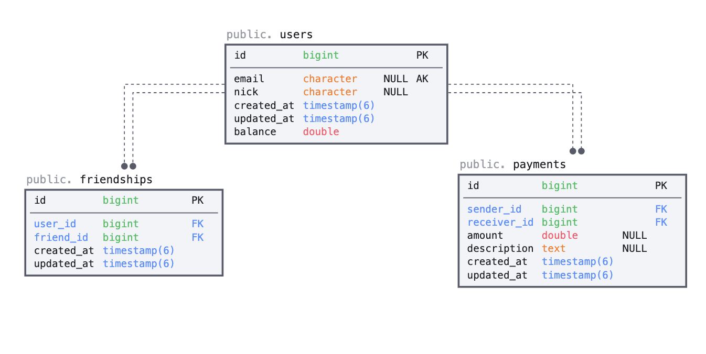

# Venmo - Social Payment Service

## Project description

Venmo is a mobile payment service which allows friends to transfer money to each other. It also has some social features like show your friends payment activities as feed. In this project we will try to simulate part of the functionality through an API.
I will simulate build a simple payment system like Venmo with following functionalities:

  1. Send payment to a friend
  1. List friends’ payment activities including yours in the feed

## RESTful APIs
A common practice in API is to be able to support versioning, due to this, all endpoints must start with `/api/v1/`. The project supports the following endpoints:

##### `POST /api/v1/user/:id/payment`
This endpoint generate payment transactions between users who are friends
**Request body**:

```json
{
    "payload": {
        "friend_id": 2,
        "amount": 100,
        "description": "For shoes"
    }
}
```

The payment process include many instruction that should not be in the controller, either in the model.
That is why I used the concept of service object, I had to create the `services` folder and inside that the file `payment_service.rb`, this file is a `plain old ruby object (PORO)` and it's in charge of carrying out a transaction between users.

The instruction order comes as follows

  * Create the object `PaymentService.new(@user, payload_params)`
  * Execute the `call` method
      ```
        1. Run validations before send payment
        --- BEGIN TRANSACTION --
        2. Guarantee money (if `sender` don't have enought money ask to bank)
        3. Debit from `sender`
        4. Credit from `receiver`
        5. create the `payment` record
        --- END TRANSACTION --
      ```

If everything went well, the transaction was carried out successfully, it any instruction fail inside the `transaction block`, I discard the changes and return the error.

As you can see the transfer is an atomic execution and the implementation from Payment as a service makes the code much cleaner and readable

#### `GET /api/v1/user/:id/feed?page=N`

This endpoint show all activities of user and user's friends.

The class method `Payment.activity_feed(user)` get all information needed to show in the json response.
Supposed the user who sent the request is Juan

  1. Get all payments sender from Juan
  1. Get all payments sender from Juan's friends (in this case I get payments to Juan if they exist)
  1. Get all payments sender from Juan's friends of friends

All the results must be ordered in reverse chronological, for that was created the scoped method `by_newest` in payment class.
Also a pagination was required, this requirement was supported by [pagy](https://ddnexus.github.io/pagy/how-to.html#gsc.tab=0) gem

A couple of considerations that were supported by the gem are listed below:
  1. If params `page` is not exist the system show the first page
  1. If params `page` is grather than the last page, the system show the last avaible page
  1. The `meta` field sended in the response is generate by this gem

For more info about this options, take a look in `config/initializer/pagy.rb`

**Response body**:
```json
{
    "meta": {
        "count": 4,
        "page": 1,
        "prev": null,
        "next": null,
        "last": 1
    },
    "data": [
        {
            "id": 2,
            "title": "juan paid jose on 2021-05-18 17:26:37 UTC - "
        },
        {
            "id": 1,
            "title": "jose paid pablo on 2021-05-18 17:26:30 UTC - school"
        },
       ...
    ]
}
```

##### `GET /api/v1/user/:id/balance`

This endpoint get the user's balance

**Response body**:
```json
{
    "balance": 430.0
}
```


## Entity–relationship model
The business logic is represented with the following entity relationship diagram


## Models involved

### Friendships

This model appear because it's needed to connect users between them by the "friendship" relationship
One of the mandatory requirement is `users can send money to each other only if they are friends`
Due to this, appear the `N:N` relationship of users.

One importan decision appear here, the `frienship` relationship is bi-derectional and we don't want to have replicated information, so when a relathipnship is inserted I validate this with some restrictions.

The `Friendship` was model with two fields `user` and `friend` and both users are indifferent to the system.

###### Restrictions

Due to the previously explained, there are two validations that were developed
  1. There should not be two records that connect the same users either in `user` or `friend` (other user)
  1. There should not be connect yourself as a friend


### Users
Users are those who use the system, and each one of them has an `email`, a `nick` and a `balance`, this last field is updated every time a transaction is made between users

In this model was needed to add to `has_many` relathipnship, because as I said before, the `frienship` relationship is bi-derectional

So, I have `has_many :friends` and `has_many :reverse_friends`, after that is easy to define the user's friends
combine both associations


### Payments
For each money transfer between friends a payment is created.
In this model I will track all the transaccion that users carry on, and for that, is necessary to have information about the `sender`, the `receiver` and a brief `description` is the sender want to send.
Also has a timestamp that show information about when the payment was made (field `created_at`)

This record is created within an atomic transaction inside a `PaymentService` and is created if and only if can debit from sender & can credit to receiver

If any of then fails, the payment is refused, and the record is not saved

###### Restrictions

The `amount` transaccion  must be positive and less than $1000, you can see this validation inside the model

## Instructions

### Install & configuration

This proyect was developtment in:

  1. Rails 6.1.3.2
  1. ruby 2.7.2
  1. Bundler version 2.2.15
  1. PostgreSQL 13.2

Clone the project `git clone https://github.com/jeroig/venmo.git`
After that run `bundle install`

#### Create and initialize Database

1. run `bundle exec rails db:create`
1. run `bundle exec rails db:migrate`
1. run `bundle exec rails db:seeds`

### Test

For running test you must execute `bundle exec rspec`

## Other comments

### Manual test
The project include in `app/info` folder a json file `Venmo.postman_collection.json` that can be imported into postman for manual testing, but before do that is important to execute the points mencioned in `Create and initialize Database` from this README.md

### Code quality
The system includes two gems to add quality to the code
1. `Annotate` (Add a comment summarizing the current schema to the models and factories)
1. `Rubocop` (Code linter)

### Branches
I used `main` branch as a master/production branch, for develop I use `devel` branch and the convention was the following:
For each feature, I generate a new branch from `devel`, then as many commits as necessary are created during this new branch until the feature is closed. After that a pull request from this branch again `devel` is sended.

When the code are ready to publish, I send a new pull request from `devel` to `master`.
